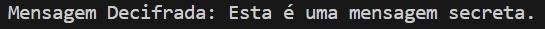

<h1 align="center">AES Encryption and Decryption</h1>

## Project
This project demonstrates the implementation of encryption and decryption of messages using the AES (Advanced Encryption Standard) algorithm. The application provides functions to encrypt and decrypt text messages, accepting a user-defined encryption key.

## Implementation
The project includes the following features:
- Padding and unpadding messages to match the block size of AES.
- Encryption of messages using a 32-byte key in CBC mode.
- Decryption of messages with the provided key.

## Technologies Used
- **Programming Language:** Python
- **Library:** cryptography

## Usage
```python
from cryptography.hazmat.primitives.ciphers import Cipher, algorithms, modes
from cryptography.hazmat.primitives.kdf.pbkdf2 import PBKDF2HMAC
from cryptography.hazmat.primitives import padding, hashes
from cryptography.hazmat.backends import default_backend
import os
import base64

def generate_key(password):
    salt = b'salt_'  
    kdf = PBKDF2HMAC(
        algorithm=hashes.SHA256(),
        length=32,
        salt=salt,
        iterations=100000,
        backend=default_backend()
    )
    return kdf.derive(password.encode())

def encrypt(message, password):
    key = generate_key(password)
    iv = os.urandom(16)
    cipher = Cipher(algorithms.AES(key), modes.CBC(iv), backend=default_backend())
    encryptor = cipher.encryptor()
    
    padder = padding.PKCS7(128).padder()
    padded_message = padder.update(message.encode()) + padder.finalize()
    
    encrypted_message = encryptor.update(padded_message) + encryptor.finalize()
    return base64.b64encode(iv + encrypted_message).decode()

def decrypt(encrypted_message, password):
    encrypted_message = base64.b64decode(encrypted_message)
    iv = encrypted_message[:16]
    key = generate_key(password)
    
    cipher = Cipher(algorithms.AES(key), modes.CBC(iv), backend=default_backend())
    decryptor = cipher.decryptor()
    
    decrypted_message = decryptor.update(encrypted_message[16:]) + decryptor.finalize()
    
    unpadder = padding.PKCS7(128).unpadder()
    unpadded_message = unpadder.update(decrypted_message) + unpadded_message.finalize()
    
    return unpadded_message.decode()

# Exemplo de uso
mensagem = "Esta é uma mensagem secreta."
chave = "minha_chave_secreta"

mensagem_cifrada = encrypt(mensagem, chave)
print(f"Mensagem Cifrada: {mensagem_cifrada}")

mensagem_decifrada = decrypt(mensagem_cifrada, chave)
print(f"Mensagem Decifrada: {mensagem_decifrada}")


## Execution
<div align="center">   </div>

## Author
Code by Gabriela Oliveira


### Conteúdo do `main.py`
```python
from Crypto.Cipher import AES
from Crypto.Random import get_random_bytes
import base64

def pad(s):
    return s + (AES.block_size - len(s) % AES.block_size) * chr(AES.block_size - len(s) % AES.block_size)

def unpad(s):
    return s[:-ord(s[len(s)-1:])]

def encrypt(message, key):
    key = key.ljust(32)[:32]  
    message = pad(message)
    iv = get_random_bytes(AES.block_size)
    cipher = AES.new(key.encode('utf-8'), AES.MODE_CBC, iv)
    encrypted_message = iv + cipher.encrypt(message.encode('utf-8'))
    return base64.b64encode(encrypted_message).decode('utf-8')

def decrypt(encrypted_message, key):
    key = key.ljust(32)[:32]  
    encrypted_message = base64.b64decode(encrypted_message)
    iv = encrypted_message[:AES.block_size]
    cipher = AES.new(key.encode('utf-8'), AES.MODE_CBC, iv)
    decrypted_message = unpad(cipher.decrypt(encrypted_message[AES.block_size:])).decode('utf-8')
    return decrypted_message

# Exemplo de uso
mensagem = "Esta é uma mensagem secreta."
chave = "minha_chave_secreta"

mensagem_cifrada = encrypt(mensagem, chave)
print(f"Mensagem Cifrada: {mensagem_cifrada}")

mensagem_decifrada = decrypt(mensagem_cifrada, chave)
print(f"Mensagem Decifrada: {mensagem_decifrada}")
